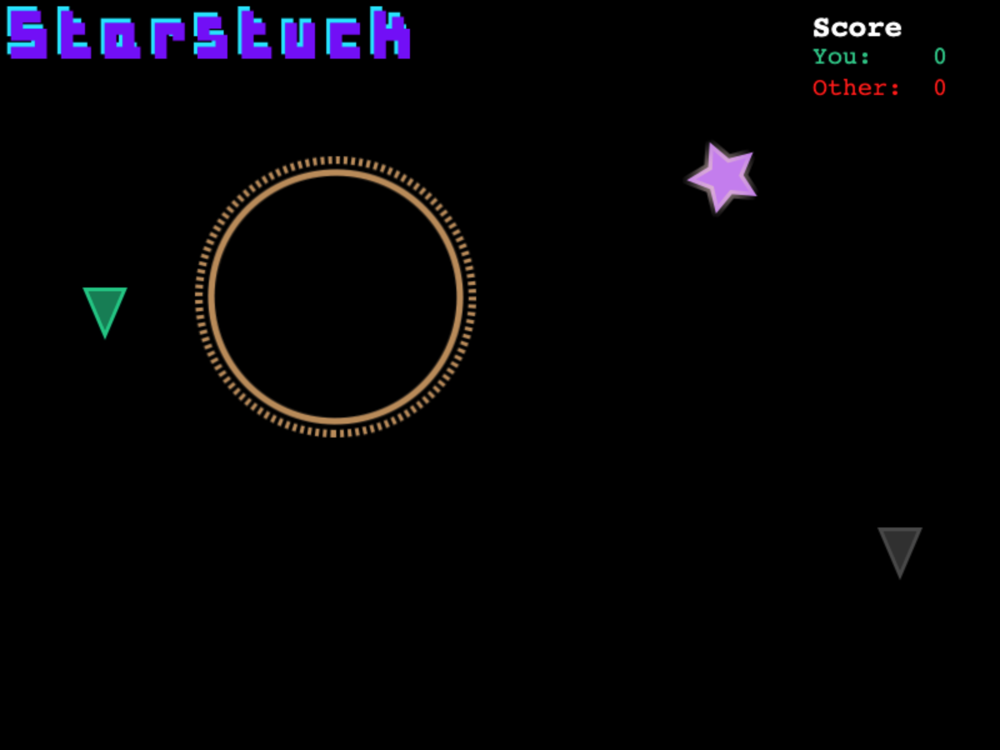

# Starstuck

This repository contains the (still buggy) prototype of an interactive game indended as a starting point for a psychology experiment. 

It was built based on [this tutorial](https://gamedevacademy.org/create-a-basic-multiplayer-game-in-phaser-3-with-socket-io-part-1/) and [this one](https://phaser.io/tutorials/making-your-first-phaser-3-game/part1).
